       

<h1 style="text-align: center;">
Is overpopulation misinterpreted by the media and global opinion?
</h1>
<h2 style="text-align: center;">
Maciej Sulecki (w1786311)
</h2>
<h3 style="text-align: center;">
May 8th, 2023
</h3>

     

<h2 style="text-align: center;">
University of Westminster
</h1>
<h5 style="text-align: center;">
School of Computer Science and Engineering
</h3>
<h4 style="text-align: center;">
Data Science & Analytics
</h2>
<h3 style="text-align: center;">
Data Visualisation and Dashboarding
</h3>
<h5 style="text-align: center;">
6DATA004W
</h4>
# The Problem

In recent years, the global population has been a topic of discussion
and controversy. Many people believe that overpopulation is one of the
biggest threats to humanity and our planet, and that we must find ways
to reduce the population in order to save the environment and ensure a
sustainable future.

##### Examples

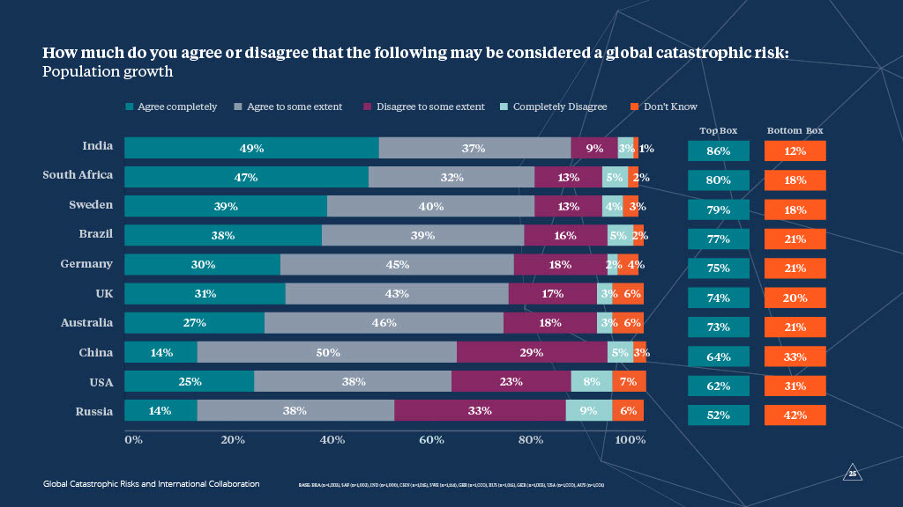

Survey responses regarding whether population
growth is a global catastrophic risk. “Top box” to the right shows the
percentage who answered “Agree completely” or “Agree to some extent,”
while “Bottom box” shows the percentage who answered “Disagree to some
extent” or “Completely disagree”. Source: [Global Challenges Foundation,
Global Catastrophic Risks and International Collaboration: Opinion Poll
2020.](https://globalchallenges.org/wp-content/uploads/GCF_Global_Challenges_2020-High.pdf)

> “The population of the world is growing at a fast rate, and it is
> expected to reach 10 billion by 2050. This is a big problem, because
> the resources of the world are limited, and the more people there are,
> the less resources there are for each person. This is why it is
> important to understand the population growth and the factors that
> affect it.”

This was written by an AI - Copilot by
GitHub, after simply writing “Population Projections” and clicking
return key in a code editor.

##### Goal

However, this paper aims to shed light on the fact that population
growth is not as much of a threat as it is often portrayed to be.
Instead, we should focus on addressing other pressing issues such as
climate change, poverty, and undernourishment.

In this report, we will analyze global population data and trends, as
well as fertility rates and life expectancy, using R and R Markdown.
Furthermore, we will evaluate the chosen technology and charting methods
to ensure a comprehensive understanding of the topic at hand.

# Data Preparation

### World Bank data

An initial exploratory analysis was conducted after preparing the data,
which was mostly clean with some missing values for years before 1992.
The data contained some regions and groups of countries, which were
removed by filtering out rows with an empty string as the Region,
indicating they were regions themselves. This data was separated in a
metadata file and then inner joined with the population growth data on
the Country.Code column, resulting in only country-level data.

The country-level data was reshaped to a long format with each row
representing a country and year. The population growth rate was
calculated by multiplying the population by the growth rate and summing
the results. Finally, the worldwide population growth rate was obtained
by dividing the sum of the weighted growth rates by the sum of the
population. The already calculated worldwide population growth rate was
also saved in a separate dataset for comparison purposes.

The libraries - `scales`, `dplyr`, `gridExtra` and `tidyverse` were used
to prepare the data. The `scales` library was used to format the numbers
in the plots, `dplyr` was used to reshape the data, `gridExtra` was used
to arrange the plots in a grid and `tidyverse` was used to filter out
the regions and groups of countries.

Since the datasets from the World Bank data are in the same format, most
of the analysis was abstracted away into a function that will be used
further in the paper to prepare, clean and format the data for
visualisations.

### Other sources

While most of the paper is based on data from the World Bank, there are
also two other sources - United Nations and Our World in Data. These two
sources are completely different from the World Bank and needed their
own data preparation and cleaning. Also the data from the data from the
UN came in Excel format, which needed another library - `readxl` to be
read into R.

Both of these were handled without creating abstraction functions as
they were used only once in code, additionally the data from the Our
World in Data was already in a long format, so it only needed to be
cleaned, while the data from the UN needed to be reshaped to a long
format, similarly to the World Bank data.

More information about the data sources can be found in the Sources of
Data chapter.

# Population Worldwide

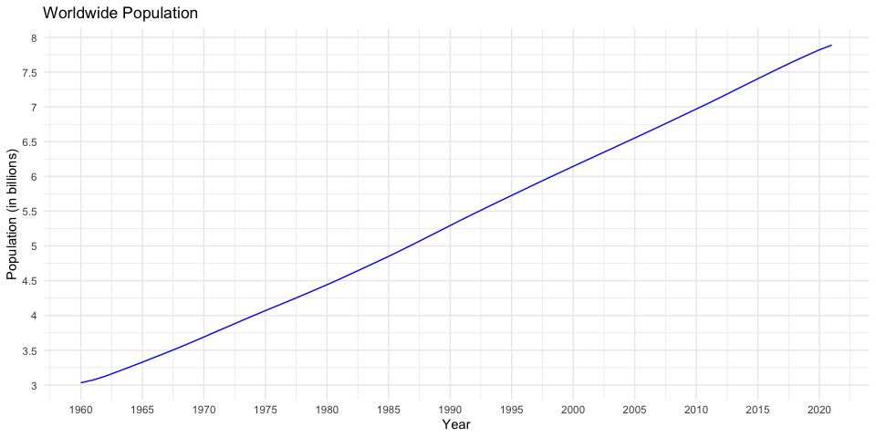

Lets start by looking at the population worldwide, when faced with this
chart alone, it seems the easy conclusion is, yes, there is a problem,
the population is rising out of control, 61.6% in 60 years. But is it
really?

# Worldwide Population Growth Rate

The growth rate of a population is determined by the difference between
births and deaths during a specific time period, relative to the initial
population size. It is expressed as a percentage and known as the
population growth rate. The available data provides year-by-year
statistics for each country in the world, along with several groups of
countries, and the worldwide population growth rate, however the is no
information about how the worldwide population growth rate is
calculated, hence it will be calculated in this chapter.

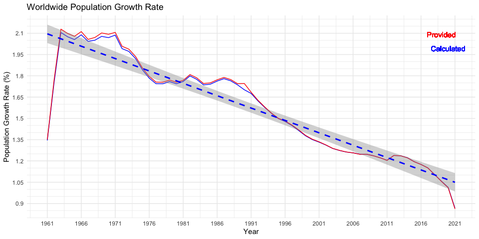

### Calculation analysis

An analysis of the provided data revealed that the median difference
between the two growth rates is negligible, at 0.48%, with a mean
difference of 0.47%. The largest difference between the two growth rates
is 2.52%, and it occurred in 1990. The biggest differences were found in
the period between 1961 and 1992, which is the period with the most
missing and inaccurate data. However, starting from 1993, the provided
data is more accurate, and the differences are almost non-existent, with
a median of 0.12%.

### Conclusion

It can be concluded that the provided data was calculated correctly,
taking into account the populations of different countries, and
therefore is accurate and trustworthy enough to be used for analysis.
After examining the worldwide population growth rate, it is evident that
the growth rate is not constant and is rapidly decreasing by 169.3%
since its climax in 1963, which could indicate that the population
numbers will start decreasing in the near future.

## Population in Europe & Central Asia

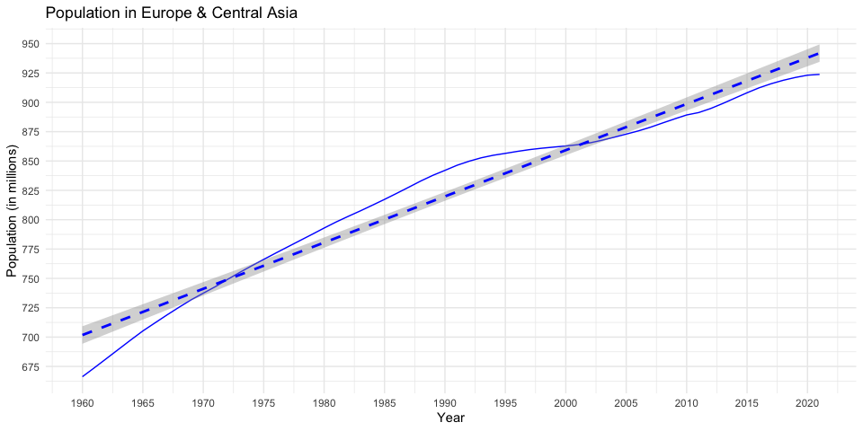

It may seem at first that the population growth rate in Europe & Central
Asia is similar to the worldwide population growth rate, but is that
really the case?

Examining the data, it becomes clear that the population in Europe &
Central Asia has grown at a significantly slower rate than the worldwide
population, increasing by only 38.6% over the last six decades.

## Fertility in Europe & Central Asia

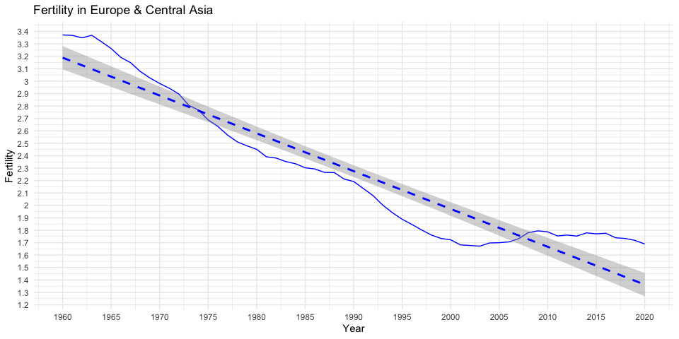

However, a different trend emerges when we examine the fertility data.
In fact, the fertility rate has decreased by a significant 49.9% in the
last 60 years. Although there was a brief period of rebound in fertility
from 2002-2016, the trend has since continued its downward trajectory.

Furthermore, when we examine both the fertility and population growth
rate graphs together, a clear correlation emerges. The rebound in
fertility rate is followed by a rebound in population growth rate, with
a minor delay. However, given the clearly downward trend in fertility
rate, we can anticipate a slow down or even a plateau in population
growth rate in the future. Only time will tell.

## Central Europe and the Baltics

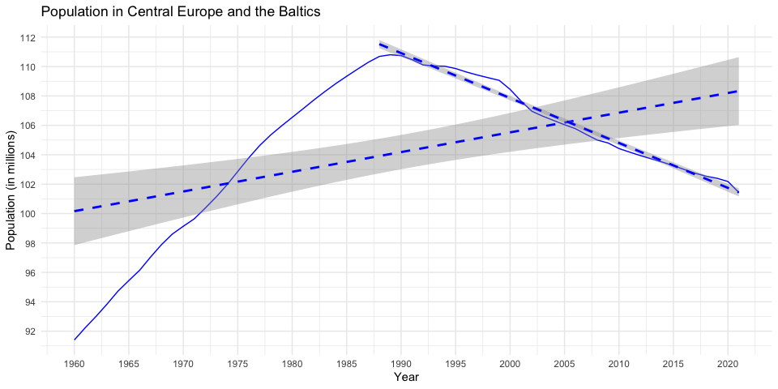

Upon examining the data on Central Europe and the Baltics, it is
apparent that the population is not growing but rather decreasing. The
growth rate of the population was positive from 1960 to 1987, having
increased by 21.2% during that time. However, it has been in decline
since then and has dropped by 8.5% from its peak. The trend implies that
the population in this region will continue to decrease significantly in
the foreseeable future.

## Population in Sub-Saharan Africa

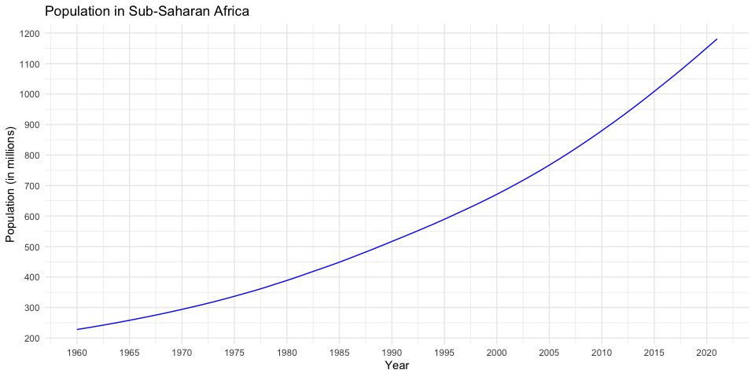

In contrast to Europe & Central Asia, Africa presents a different
situation where the population is increasing at a rapid pace. The data
shows that since 1960, the population has grown by 418.2%, which is over
ten times the growth rate of Europe & Central Asia over the same period.

## Fertility in Sub-Saharan Africa

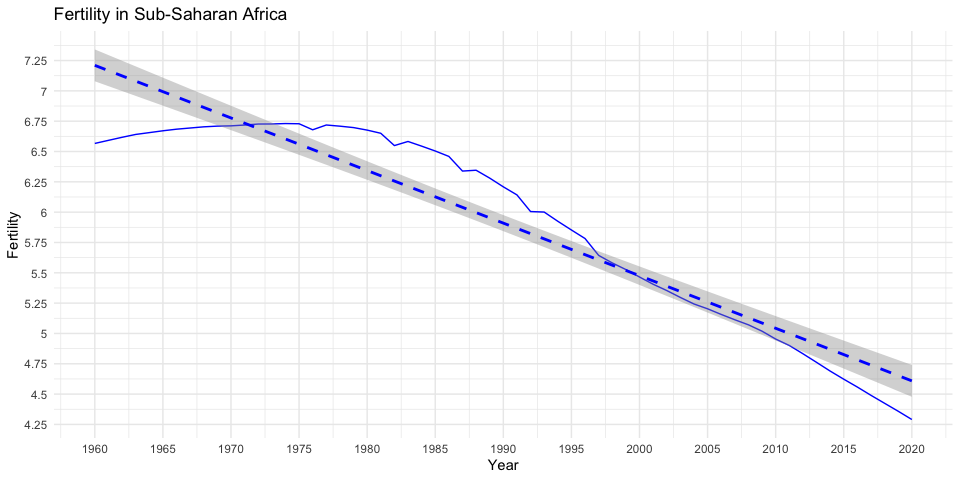

Despite a much higher fertility rate in Africa compared to Europe &
Central Asia, the fertility rate in Africa has been declining rapidly
since its peak in 1974, having already decreased by 36.3%. This is a
similar pattern to what has been observed in Europe & Central Asia, and
as population growth slows down, it may eventually come to a halt or
even reverse.

# World Fertility vs Life Expectancy

### Chart Note

The presented chart displays the fertility rate and life expectancy in
years. To facilitate comparison and identify any correlation, the
fertility rate is multiplied by 10.

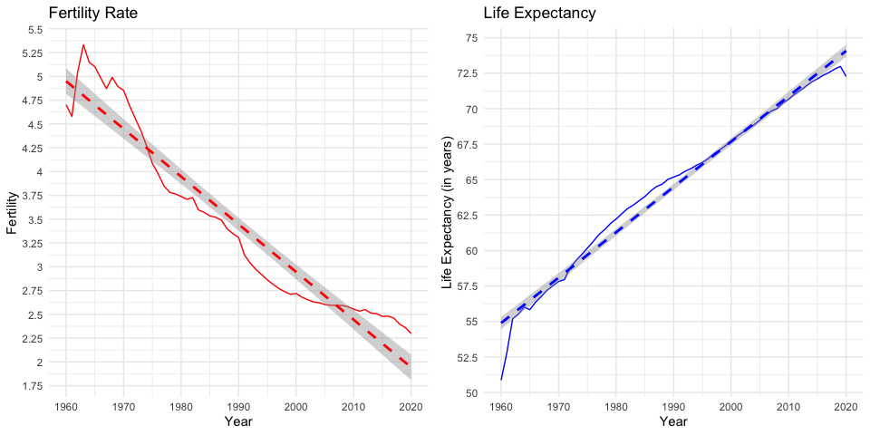

Apart from fertility rate, another factor that impacts global population
growth is the life expectancy. In the past 60 years, life expectancy has
increased by 42.1% and is expected to continue to rise in the future. At
the same time, the fertility rate has dropped by 56.9% during the same
period, and is expected to continue decreasing in the future.

This further highlights how the current world population growth is
likely to slow down and ultimately cease. It can be inferred that the
main contributing factor to maintaining global population growth is the
extended life expectancy. However, considering the higher rate of change
in fertility rate, it is probable that the population growth will not
only stop, but also decline in the future.

# UN Projections

## World Population

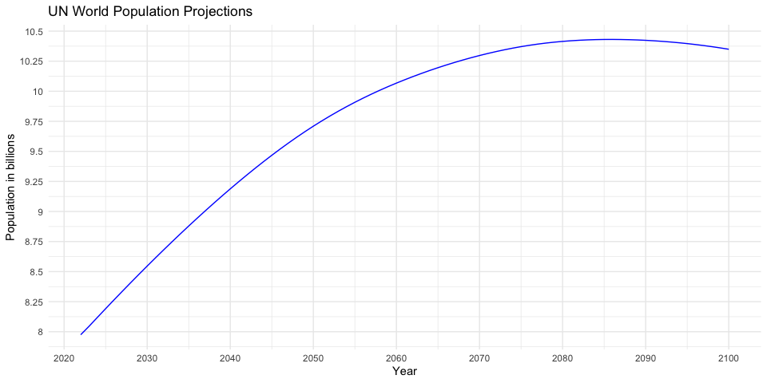

According to the UN Population Projections, the world population is
expected to continue growing but at a decreasing rate and eventually
stabilize. The projected peak population is estimated to be reached in
2086 with 10.43 billion people, indicating an increase of 30.8% from the
current population. Following that, the population is expected to
decline to 10.35 billion people by 2100, which is a decrease of 0.8%
from the peak in 14 years. While this decrease may not seem significant,
it marks a turning point in the world’s population growth.

Furthermore, if we compare the Central Europe and the Baltics charts, we
can see some similarity. If this region is any indication of the world’s
population growth, then it suggests that a significant decline in
population is likely in the foreseeable future.

## World Fertility

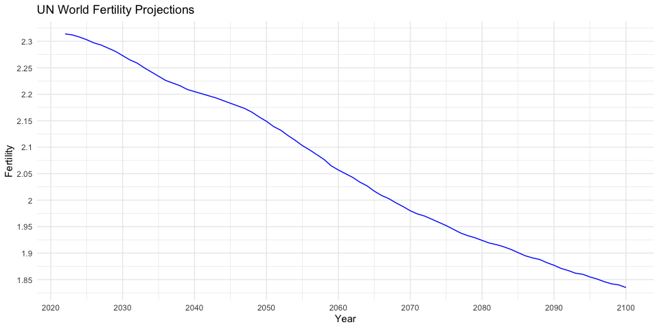

The fertility projections show that the fertility rate is projected to
decrease to 1.83 by the year 2100, representing a decrease of 20.7%.
Based on the previous population-fertility trends, it is expected that
the population will follow suit with a drop, although the exact timing
of this decline is unknown. However, we can infer from the example of
the Central Europe and the Baltics region that a significant population
decline can be expected in the future.

# Problems - Undernourishment, Poverty, School Enrollment and Global Warming

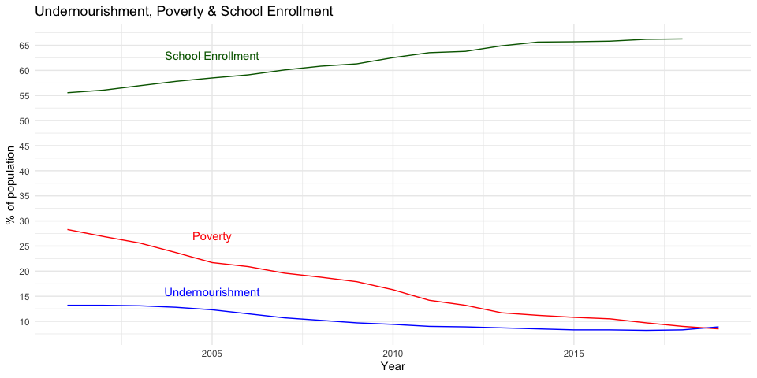

## Scope, outcomes and conclusions

I want to begin by acknowledging the importance of the problems we face
as a global community, as examples I will discuss undernourishment,
global hunger, poverty, and climate change. These issues are incredibly
serious and require our attention and action to make progress towards a
more sustainable future.

However, all of these are often associated with overpopulation, and I
want to take a moment to provide some hope and optimism for the future.
While some may try to scare us with concerns of overpopulation, judging
by the data, we can see that rapid population growth is not the cause of
these problems. In fact, we have seen progress in reducing
undernourishment and poverty over the years, and this progress is
expected to continue while the global population is still on the rise.
While there was a rebound in undernourishment in 2018, we know that this
was likely caused by other factors such as climate change and the
COVID-19 pandemic.

While I have not delved deeply into the topic of global warming in this
paper, I believe it is a problem that we can address through fighting
pollution and taking action to mitigate the effects of climate change.
We do not need to focus on limiting population growth, as the data shows
that population growth is already slowing down and will likely come to a
stop or decline in the near future.

In closing, I want to emphasize that while we still have work to do to
address the challenges we face, we should also take hope in the progress
we have made and the promise of a more sustainable future. Let us
continue to focus on the real issues and work towards a better world for
all.

# Summary

In conclusion, presenting the population growth as one of the biggest
threats to humanity is inadequate and misleading. Instead, we should
adopt a more optimistic perspective, viewing the growing population not
as a threat, but as a challenge that we can overcome. We must focus on
addressing the real problems that humanity faces and strive towards
creating a better world for everyone.

An increase in population also means an increase in the number of
intelligent individuals who can contribute to finding solutions for the
problems we face. As our population grows, so does our collective
knowledge, creativity, and capacity for innovation.

It is easy to fall for the extreme narrative that portrays people as the
source of all problems, but this perspective is not accurate. We should
not be afraid of the future; instead, we should embrace it with hope and
determination. By working together and leveraging our collective
intelligence, we can overcome the challenges of population growth and
create a world that is not only sustainable but also thriving.

This optimistic view is shared by philosopher William MacAskill in his
book **What We Owe the Future: A Million-Year View** (MacAskill, 2022).
In it, he argues for longtermism – the idea that positively influencing
the distant future is a key moral priority of our time.

Let this conclusion serve as an inspiration for future research,
policy-making, and individual actions. Together, we can shape a future
that is not only optimistic but also truly transformative for
generations to come.

# Sources of Data

To study population growth across different facets of human life, this
research has relied on data from several sources, including the World
Bank, United Nations, and Our World in Data.

## World Bank

The World Bank is renowned for providing a wide array of indicators
related to population, education, and poverty. The following indicators
were included in the analysis:

1.  Total Fertility Rate (SP.DYN.TFRT.IN): This metric calculates the
    average number of children born per woman, considering the
    prevailing age-specific fertility rates throughout her reproductive
    period (World Bank, n.d.a). The data is available at:
    <https://data.worldbank.org/indicator/SP.DYN.TFRT.IN>.
2.  Life Expectancy at Birth (SP.DYN.LE00.IN): This figure estimates the
    mean number of years a newborn is expected to live, assuming that
    current mortality patterns persist throughout their life (World
    Bank, n.d.b). The data is available at:
    <https://data.worldbank.org/indicator/SP.DYN.LE00.IN>.
3.  Population Growth Rate (SP.POP.GROW): This metric highlights the
    annual percentage increase in the population (World Bank, n.d.c).
    The data is available at:
    <https://data.worldbank.org/indicator/SP.POP.GROW>.
4.  Total Population (SP.POP.TOTL): This value represents the overall
    number of individuals living in a specific country or region (World
    Bank, n.d.d). The data is available at:
    <https://data.worldbank.org/indicator/SP.POP.TOTL>.
5.  Poverty Headcount Ratio at $1.90 per day (SI.POV.DDAY): This figure
    captures the percentage of the population surviving on less than
    $1.90 per day at 2011 international prices (World Bank, n.d.e). The
    data is available at:
    <https://data.worldbank.org/indicator/SI.POV.DDAY>.
6.  Net Enrollment Rate in Primary Education (SE.PRM.NENR): This ratio
    expresses the number of children of the official primary school age
    who are enrolled in primary education as a percentage of the total
    official school-age population (World Bank, n.d.f). The data is
    available at: <https://data.worldbank.org/indicator/SE.PRM.NENR>.

The World Bank is a credible institution, and its data is frequently
used in academic research and policy studies. However, it is important
to consider potential data coverage or accuracy limitations for specific
countries or time periods.

## United Nations

The United Nations Department of Economic and Social Affairs provides
population data through the World Population Prospects. This dataset
contains population estimates and projections for all countries and
regions, including a range of demographic indicators such as population
size, growth, and composition (United Nations, n.d.). The data is
available at: <https://population.un.org/wpp/Download/>.

## Our World in Data

Our World in Data is another data source utilized in this study. This
non-profit research organization provides datasets and visualizations
related to a range of global issues, including undernourishment. The
proportion of the total population experiencing undernourishment has
been included in this study (Our World in Data, n.d.). This data is
publicly accessible at
<https://ourworldindata.org/hunger-and-undernourishment>.

It is important to note that while these data sources are widely
recognized and respected, limitations such as data accuracy or coverage
issues may be present for specific countries or time frames.

# Technology Evaluation: R and R Markdown

R is a popular and widely-used programming language for statistical
computing and graphics, which makes it an ideal choice for data analysis
and visualization tasks (R Core Team, 2021). Moreover, R Markdown is a
powerful tool that allows for the creation of dynamic documents,
combining the functionality of R programming with the flexibility of
Markdown, a lightweight markup language (Xie et al., 2018). This
combination provides a seamless and efficient way to conduct data
analysis and present the results in a clean and organized manner.

In this paper, we have utilized line charts to display the data. Line
charts are a common and effective way to visualize trends and changes
over time (Few, 2009). They allow for easy comparisons between variables
and help in identifying patterns or anomalies in the data. Line charts
are particularly useful when dealing with time-series data, as they
clearly represent the progression of the variables over the years. In
our case, line charts have enabled us to efficiently showcase the
relationship between variables such as fertility rates, life expectancy,
population growth, and other factors.

The whole report is written in R Markdown and available at
<https://github.com/beeinger/world-overpopulation>, all data preparation
is visible there and can be easily reproduced by opening the
`report.rmd` in RStudio or any other IDE that supports R Markdown.

# References

Few, S. (2009) Now You See It: Simple Visualization Techniques for
Quantitative Analysis. Analytics Press.

R Core Team (2021) R: A language and environment for statistical
computing. R Foundation for Statistical Computing, Vienna, Austria.
Available at: <https://www.R-project.org/> (Accessed: 7 May 2023).

Xie, Y., Allaire, J.J., and Grolemund, G. (2018) R Markdown: The
Definitive Guide. CRC Press.

Project, O.R. (2021) Survey shows the general public is ready for
discussions about population, The Overpopulation Project. Available at:
<https://overpopulation-project.com/survey-shows-the-general-public-is-ready-for-discussions-about-population/>
(Accessed: 7 May 2023).

MacAskill, W. (2022) What We Owe the Future: A Million-Year View.
Oneworld Publications.
